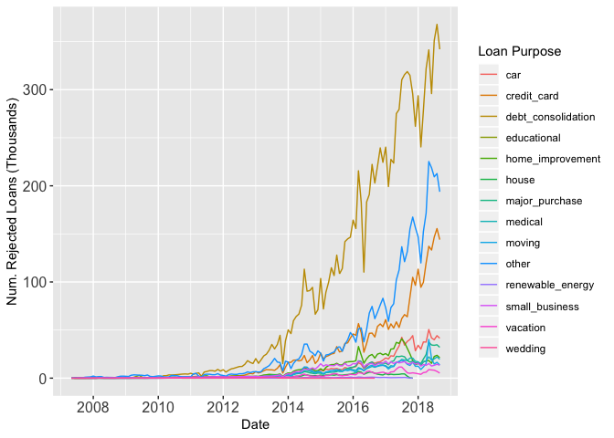

LendingClub Rejected Loans
================

LendingClub is a peer-to-peer lending service that publishes data of all granted and rejected loans from 2007 to Sep. 2018. This includes information about why someone was requesting a loan. I looked at how the number of rejected loan requests changed over time depending on what the loan was for.

``` r
library(data.table)
```

    ## Warning: package 'data.table' was built under R version 3.5.2

``` r
library(ggplot2)
rejectAppsByMonthPurpose <- fread('rejectAppsByMonthPurpose.csv',header=TRUE,data.table = FALSE)
rejectAppsByMonthPurpose$date <- as.Date(rejectAppsByMonthPurpose$Group.1,"%m/%d/%y")

p <- ggplot(data=rejectAppsByMonthPurpose, aes(x=date,y=count1000,colour=Group.2))
p + geom_line() + labs(y = 'Num. Rejected Loans (Thousands)', x='Date', color='Loan Purpose') + 
  theme(axis.text=element_text(size=12))
```



Credit card and debt-related requests increase, mirroring similar increases in accepted loans in those categories for that time period (not shown here). However, there is also an increase in car-related loan requests starting in 2017 of which very few are accepted. Small business loan requests remain constant from 2015 onward perhaps because the young people who are reflected in this dataset are straddled with massive credit card debt.
