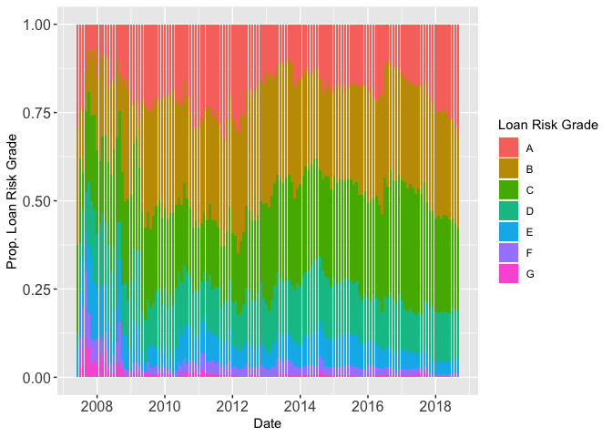

LendingClub Loan Proportions
================

LendingClub is a peer-to-peer lending service that publishes data of all granted and rejected loans from 2007 to Sep. 2018. This includes information about the "Grade" of a loan request which is determined by a borrows credit history, credit rating, and debt-to-income ratio among other factors. Tracking what kinds of loans lenders are willing to finance might reflect the increasing needs of borrowers and lenders' confidence in repayment, perhaps based on what is going on more broadly in the economy.

``` r
library(data.table)
```

    ## Warning: package 'data.table' was built under R version 3.5.2

``` r
library(ggplot2)
loanGrade <- fread('loanGrade.csv',header=TRUE,data.table = FALSE)
loanGrade$date <- as.Date(loanGrade$date,"%Y-%m-%d")

p3 <- ggplot() 
p3 + geom_bar(data=loanGrade,aes(x=date,y=count1000,fill=Group.2),position="fill",stat="identity") + 
  labs(x='Date',y="Prop. Loan Risk Grade", fill='Loan Risk Grade') +
  theme(axis.text=element_text(size=12)) 
```



Starting in 2012, the proportion of Grade A (best) loans decreased from 25% to 12% while the proportions of riskier Grade C and D loans (which incur higher rates) increased. Starting from 2016, the proportion of A loans has gradually increased from 12% up to 32% in Sep. of 2018, which is the largest proportions of A loans granted in the last six years. At the same time, the number of granted high risk loans (E, F, and G ratings) now make up less than 6% of the all loans granted (compared to a high of 12% in 2014). This may reflect an increase in the number of high-quality borrowers asking for low-risk loans, or it might indicate reticence on behalf of lenders. Both interpretations can be interesting: if there are more qualified borrowers, this might mean that people who normally do not need to borrow money because they have low debt-to-income ratios are now finding themselves strapped for cash. Alternatively, it might indicate that lenders are looking for safer investments because they are not confident in other investment options or in borrowers' ability to repay in the long-term. This suggests a growing general economic unease from 2016-2018 for the group of people who are using this service.
